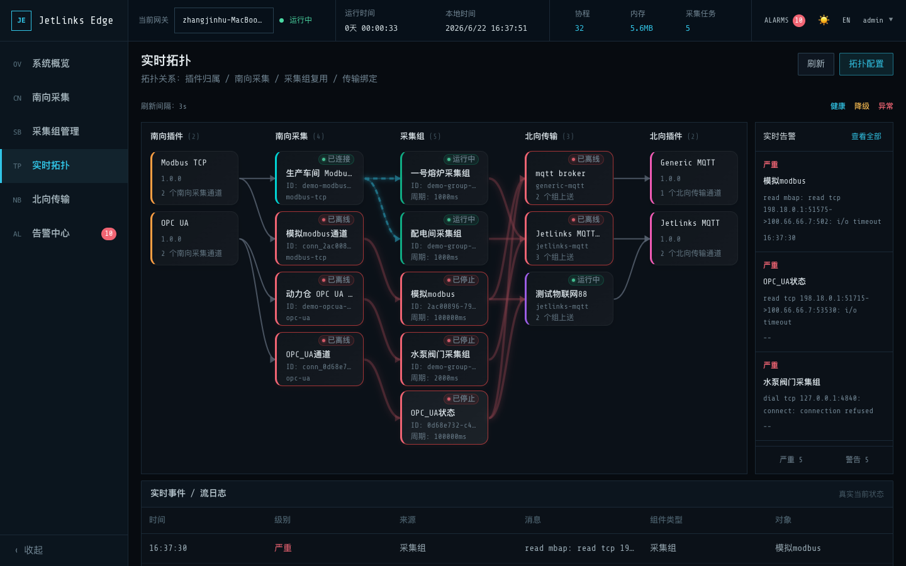
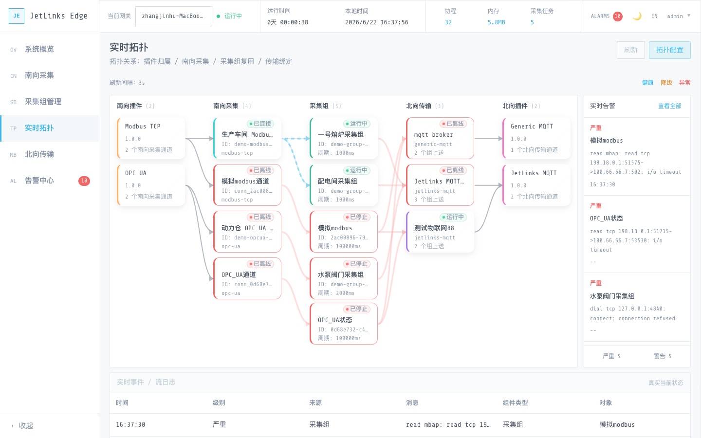
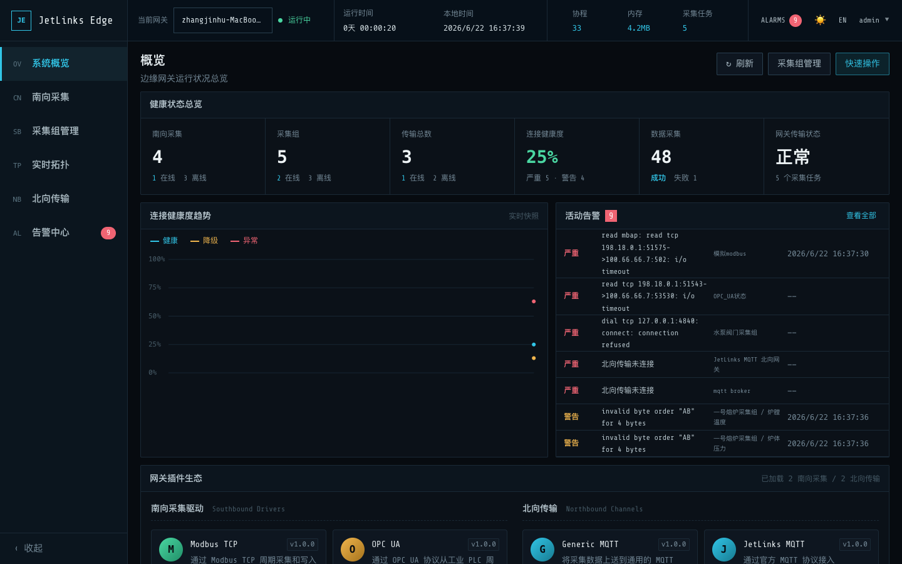
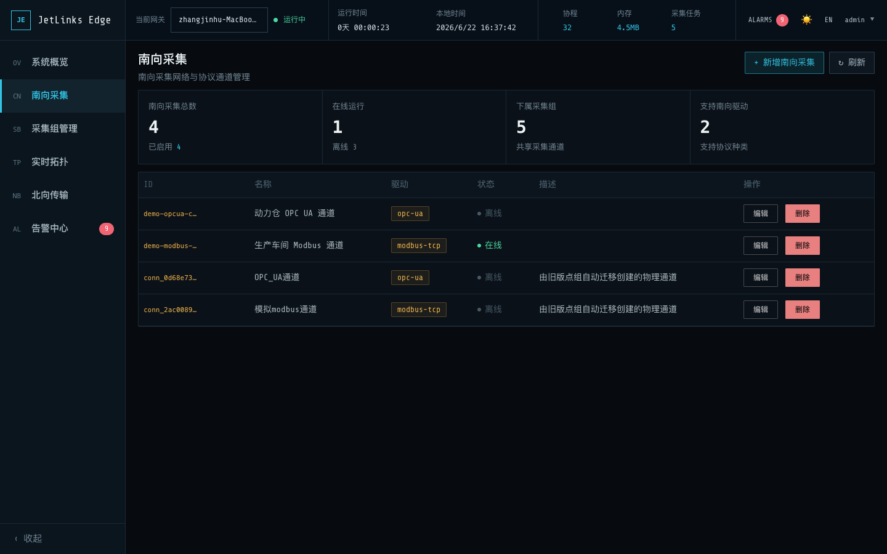
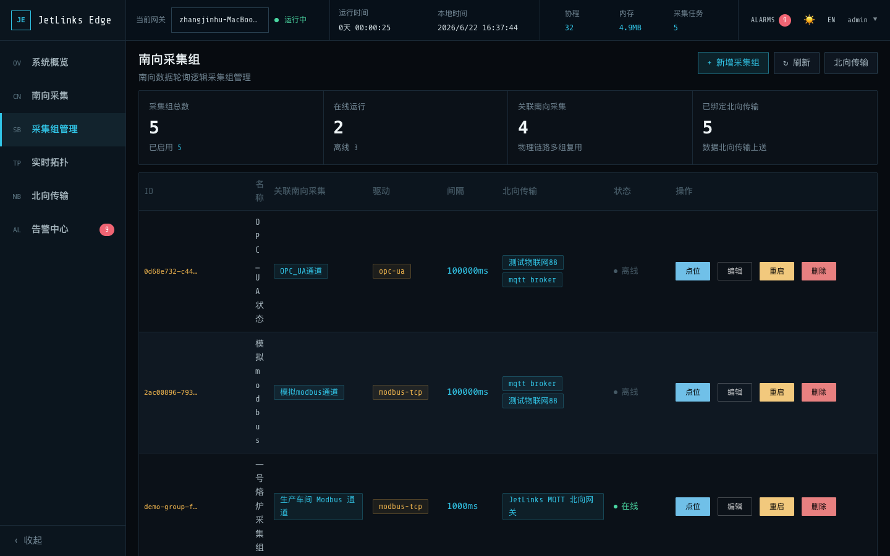
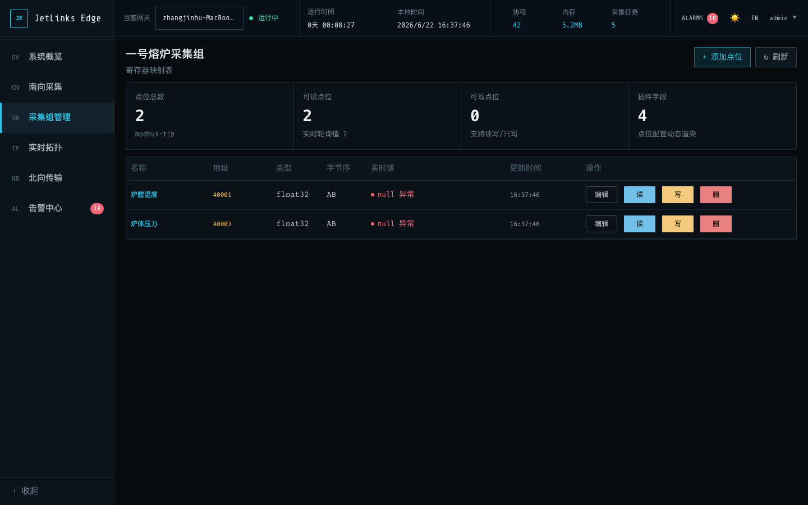
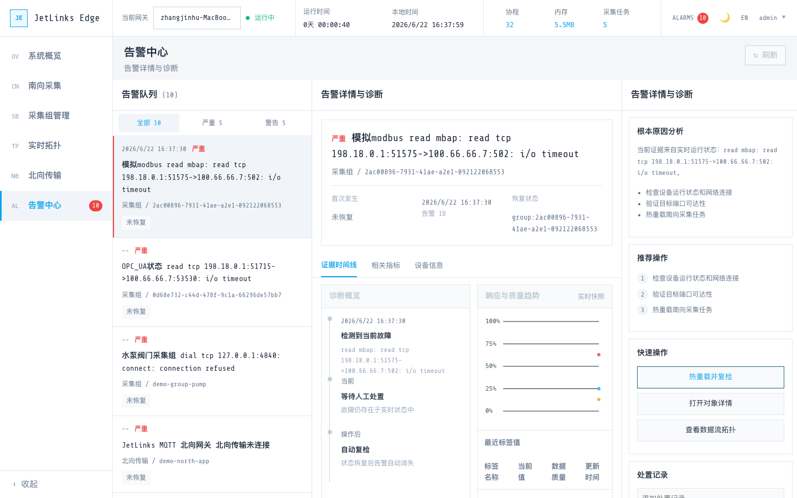
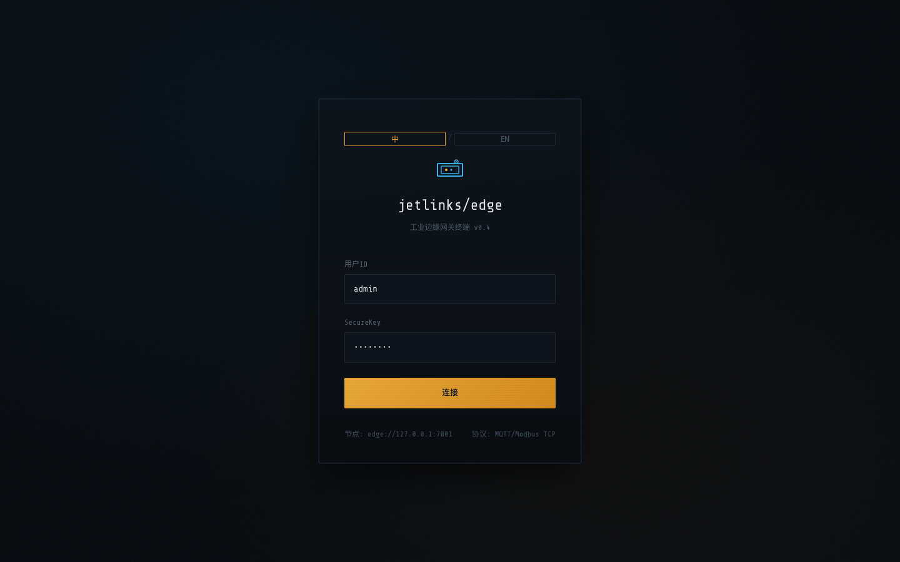

# JetLinks Edge

JetLinks Edge 是面向工业物联网场景的高性能、轻量级边缘采集网关，基于 Go 语言开发。

系统采用模块化与插件化架构，提供：**南向多协议工业设备采集**（内置 Modbus TCP、OPC UA 及跨平台进程级外部插件）→ **统一调度与事件总线引擎** → **北向物联网平台上报**（原生支持 JetLinks 平台官方网关与子设备模型，以及通用 MQTT 协议）。

---

## 核心设计与技术亮点

* **纯 Go 零 CGO 编译**：存储层使用纯 Go 实现的 SQLite（`glebarez/sqlite`，兼容标准 SQLite），在 `CGO_ENABLED=0` 下可无缝跨平台交叉编译，支持 AMD64、ARM64、ARMv7 等各类边缘计算硬件与工控机。
* **单二进制自包含交付**：前端静态资源通过 Go 1.16+ `embed.FS` 机制直接内嵌至可执行文件中，无需部署外部 Nginx、Node.js 运行时或外部数据库，单文件开箱即用。
* **物理链路与逻辑设备解耦**：采用 **“南向连接 (Connection) - 采集组 (Group) - 点位 (Tag) - 北向应用 (NorthApp)”** 解耦模型，支持多个逻辑采集组复用单条物理链路，有效降低底层 PLC 与网络负担。
* **双轨插件生态机制**：
  * **内置高性能插件**：基于统一的 `DriverLifecycle` / `SouthDriver` 与 `NorthMessageHandler` / `NorthHandler` 接口。
  * **进程级外部独立插件**：基于标准行式 JSON 管道通信与 JSON Manifest 元信息声明，跨平台支持 Linux、macOS、Windows，插件独立进程隔离，支持热加载与平滑热替换。
* **高可用北向异步重试队列**：为每个北向出口通道提供独立有界队列（默认容量 1024，最多 5 次指数退避重试），网络短暂波动或平台故障不会阻塞南向设备的实时采集轮询。
* **现代化工业控制台 Web UI**：内置 Vue 3 + TypeScript + Naive UI 控制台，支持中英双语与高对比度☀️白天 / 🌙夜间主题，提供自研 Canvas 2D 拓扑大屏、带悬浮探针与时间轴定位的运维趋势图、实时告警中心与插件中心。

---

## 界面预览 (Web Console)

### 🌌 实时工控拓扑大屏 (Topology Live Monitor)

拓扑图直观呈现 **“南向插件 - 南向连接 - 采集组 - 北向应用 - 北向插件”** 五级全链路拓扑，将静态插件归属卡片与实时运行态节点进行视觉分层设计，实时展示网络连通状态与动态数据流。



---

### 📊 核心管理界面大屏

| ☀️ 拓扑大屏 (白天清晰模式) | 📈 运维看板 (实时趋势图 & 关键指标) |
| :---: | :---: |
|  |  |
| **🔌 南向连接 (物理通信链路)** | **📦 采集组 (逻辑设备管理)** |
|  |  |
| **🏷️ 采集点位列表与物模型配置** | **🚨 实时告警中心** |
|  |  |
| **🔑 系统登录页 (默认预填凭据)** | **🧩 插件中心 (外部独立插件热插拔)** |
|  | 支持查看/重载进程级外部插件，呈现动态 Schema |

---

## 核心数据与业务模型

网关内部实体遵循严格的物理与逻辑分层设计（定义见 `internal/core/types.go` 与 `internal/core/connection.go`）：

```
[南向插件] ──> [南向连接 Connection] ──> [采集组 Group (逻辑设备)] ──> [北向应用 North App] ──> [北向插件]
  (驱动实现)          (物理通信参数)             (轮询周期/点位Tags/设备身份)        (MQTT通道/凭据)
```

| 实体 | 对应概念 | 说明 | 核心字段 |
|---|---|---|---|
| **南向连接** (`Connection`) | 物理通信链路 | 维持到底层设备或网关的 TCP/串口 连接，可被多个采集组复用，避免频繁开销连接 | `driver`, `config` (Host, Port, Timeout, IdleTimeout 等) |
| **采集组** (`Group`) | 逻辑子设备 | 对应 JetLinks 平台的一台子设备，统筹周期采集并绑定北向出口，引用南向连接 | `connectionId`, `intervalMs`, `device: {productId, deviceId}` |
| **点位** (`Tag`) | 物模型属性 | 隶属于采集组，映射到物理寄存器或地址，包含编解码规则 | `address`, `type`, `byteOrder`, `bit`, `decimal`, `access` |
| **北向应用** (`NorthApp`) | 云端出口通道 | 对应平台的网关接入点，维护一条稳定的长连接，与具体子设备身份解耦 | `type`, `config` (Broker, ProductID, DeviceID, 凭据等) |

---

## 协议支持与插件体系

### 1. 南向协议驱动

* **Modbus TCP (`internal/driver/modbus`, `pkg/modbuslib`)**：
  * 功能码全覆盖：FC01 (读线圈)、FC02 (读离散输入)、FC03 (读保持寄存器)、FC04 (读输入寄存器)、FC05 (写单线圈)、FC06 (写单寄存器)、FC15 (写多线圈)、FC16 (写多寄存器)。
  * **连续寄存器智能合并读取**：自动按从站号与地址区间合并离散读取请求，单次报文拉取多个点位，消除逐点轮询的协议开销。
  * 支持类型：`bool`、`int16`、`uint16`、`int32`、`uint32`、`int64`、`uint64`、`float32`、`float64`、`string`、`bytes`。
  * 字节序全面支持：`AB`、`BA`、`ABCD`、`BADC`、`CDAB`、`DCBA`，支持寄存器 bit 位提取（bool 类型）及 `decimal` 精度缩放。
* **OPC UA (`internal/driver/opcua`)**：
  * 支持安全策略：`None`、`Basic256Sha256`、`Basic128Rsa15`；安全模式：`None`、`Sign`、`SignAndEncrypt`。
  * 支持匿名登录与用户名/密码认证。
  * **节点树可视化浏览 (`NodeBrowser`)**：提供从根节点树状递归 Browse 工业 PLC 节点服务，支持在 Web 端批量勾选生成采集点位。

### 2. 北向数据上送

* **JetLinks 平台官方协议 (`internal/northbound/jetlinksmqtt`)**：
  * 严格遵循官方协议规范 V1.3.1。
  * **网关 + 子设备模型**：网关建立 1 条 MQTT 连接，多个子设备共享该长连接上送数据，极大降低服务端连接压力。
  * **动态时间戳安全认证**：`clientId = DeviceID`，`username = SecureID + "|" + timestamp`，`password = MD5(SecureID + "|" + timestamp + "|" + SecureKey)`，周期自动刷新 timestamp 保证长连接安全不过期。
  * **官方上行主题**：
    * 属性上报：`/{gwPid}/{gwDid}/child/{childDid}/properties/report`
    * 事件上报：`/{gwPid}/{gwDid}/child/{childDid}/event/{eventId}`
    * 子设备注册/状态：`/{gwPid}/{gwDid}/child/{childDid}/{register|online|offline}`
  * **官方下行控制**：读属性（`properties/read`）、写属性（`properties/write`）、功能调用（`function/invoke`），支持执行结果主动回复。
* **Generic MQTT (`internal/northbound/mqtt`)**：
  * 支持向通用 MQTT Broker（如 EMQX、Mosquitto）定时上送采集报文，支持配置发布主题、QoS 及下行控制命令响应。

### 3. 进程级外部插件协议 (External Plugins)

* 插件以独立子进程运行，与主程序通过标准输入输出（Stdio）进行行式 JSON 通信（详见 [docs/external-plugins.md](docs/external-plugins.md)）。
* 在 `plugins/` 目录放置 JSON 清单（`apiVersion: jetlinks-edge-plugin/v1`）与对应可执行文件即可完成声明。
* 支持动态元数据 Schema（连接参数、点位参数自动在 Web 表单渲染）、热加载、崩溃隔离与平滑重载。

---

## 目录结构

```
jetlinks-edge/
├── cmd/jetlinks-edge/              # 程序主入口（main.go，依赖装配与生命周期收敛）
├── internal/
│   ├── config/                     # 配置加载（Viper，支持 YAML/JSON 与环境变量覆盖）
│   ├── core/                       # 运行时核心：调度器 Runner、驱动注册表、实体模型、异步队列
│   ├── driver/
│   │   ├── modbus/                 # Modbus TCP 南向驱动实现（智能区间合并读取）
│   │   └── opcua/                  # OPC UA 南向驱动实现（支持 NodeId 浏览与安全策略）
│   ├── externalplugin/             # 跨平台外部进程插件管理器（Manifest 加载、进程适配器）
│   ├── logger/                     # Zap 结构化日志引擎
│   ├── northbound/
│   │   ├── jetlinksmqtt/           # JetLinks 官方网关与子设备 MQTT 协议实现
│   │   └── mqtt/                   # Generic MQTT 通用上送实现
│   ├── store/                      # 持久化存储层（纯 Go SQLite / PostgreSQL 双引擎）
│   └── web/                        # Gin Web 框架路由、JWT 认证中间件与 RESTful Handlers
├── pkg/
│   └── modbuslib/                  # 纯 Go 自研零外部依赖 Modbus 编解码库与 TCP 客户端
├── web/                            # Vue 3 + Vite + TypeScript + Naive UI 工业控制台
├── plugins/                        # 外部独立进程插件存放目录
├── scripts/                        # 自动化与仿真测试脚本（Modbus 仿真服务、E2E 测试、打包脚本）
├── docs/                           # 完整技术设计、协议规范与实操文档
├── Makefile                        # 统一工程构建脚本
└── config.yaml                     # 默认配置文件
```

---

## 快速开始

### 方式 1：本地编译与运行（推荐）

项目 Makefile 已将前端编译、静态资源内嵌打包与后端编译深度集成，**一步即可完成全栈构建**：

```bash
# 1. 一键构建（自动安装前端依赖、打包前端资源并内嵌编译 Go 二进制）
make build

# 2. 启动服务（读取 config.yaml 默认配置启动）
make run
```

* 启动后，浏览器访问控制台：**http://localhost:7001**
* 登录页已默认预填开发凭据：账号 `admin` / 密码 `admin123`，点击**连接**即可登录。

### 方式 2：开发调试模式（前后端热更新）

```bash
# 同时拉起后端服务（:7001）与前端 Vite 开发服务（:5173，自动代理 /api 流量）
make dev
```
前端热重载开发访问：**http://localhost:5173**。

### 方式 3：Docker 一键部署

```bash
# 构建本地 Docker 镜像并启动容器
make docker
docker compose up -d

# 查看实时运行日志
docker compose logs -f
```

---

## 生产部署方案

### 方案 A：自包含 Bundle 一键安装（最推荐）

适合工控机、工业网关盒子、树莓派等各类 Linux 生产环境，生成约 **7MB ~ 20MB** 的极简自包含包：

```bash
# 1. 本地打包（生成 deployments/edge-bundle.tar.gz，自动检测 UPX 进行极限压缩）
make bundle

# 2. 拷贝至目标边缘设备
scp deployments/edge-bundle.tar.gz user@edge-box:/tmp/

# 3. 目标机器上一键安装（自动配置绝对路径、创建专用用户、注册 Systemd 守护进程与看门狗）
ssh user@edge-box
tar -xzf /tmp/edge-bundle.tar.gz -C /opt/
cd /opt/edge-bundle
sudo ./scripts/install.sh
```

**生产运维常用命令**：
```bash
sudo systemctl status  jetlinks-edge    # 检查服务状态
sudo systemctl restart jetlinks-edge    # 重启网关服务
journalctl -u jetlinks-edge -f          # 实时查看输出日志
```

如需卸载，运行 `sudo /opt/edge-bundle/scripts/uninstall.sh`（支持 `--keep-data` 参数保留数据）。

### 方案 B：全平台跨架构打包与 UPX 瘦身

```bash
# 本地编译全部主流平台架构（linux-amd64/arm64/armv7, darwin-amd64/arm64, windows-amd64）
make bundle-all

# 或使用 Docker 容器化打包（免除本地跨平台交叉编译与 UPX 工具链依赖）
make bundle-all-docker
```

---

## 配置参考

支持通过 `config.yaml` 或系统环境变量进行配置。环境变量优先级高于配置文件。

### 核心环境变量速查

所有配置项均遵循 `JETLINKS_EDGE_<SECTION>_<KEY>` 命名规约：

| 环境变量 | 默认值 | 说明 |
|---|---|---|
| `JETLINKS_EDGE_WEB_ADDR` | `0.0.0.0:7001` | Web 管理控制台与 RESTful API 监听地址与端口 |
| `JETLINKS_EDGE_WEB_PRODUCTION` | `false` | 生产模式标识；开启时拒绝使用默认弱口令与初始 JWT 密钥 |
| `JETLINKS_EDGE_WEB_JWT_SECRET` | `jetlinks-edge-default-secret-change-me` | JWT Token 签名密钥（生产环境务必修改） |
| `JETLINKS_EDGE_WEB_TOKEN_TTL` | `24h` | 用户登录 Token 有效期 |
| `JETLINKS_EDGE_WEB_DEFAULT_USER` | `admin` | 首次初始化默认管理员用户名 |
| `JETLINKS_EDGE_WEB_DEFAULT_PASSWORD` | `admin123` | 首次初始化默认管理员密码 |
| `JETLINKS_EDGE_WEB_STATIC_DIR` | `""` | 前端静态目录（留空表示启用内嵌模式；填路径用于外挂调试） |
| `JETLINKS_EDGE_WEB_TRUSTED_PROXIES` | `[]` | 反向代理 CIDR 白名单（防 X-Forwarded-For 伪造绕过限流） |
| `JETLINKS_EDGE_LOG_LEVEL` | `info` | 日志级别：`debug` / `info` / `warn` / `error` |
| `JETLINKS_EDGE_LOG_OUTPUT` | `stdout` | 日志输出目标：`stdout` 或 `file:/path/to/log` |
| `JETLINKS_EDGE_STORAGE_DRIVER` | `sqlite` | 存储引擎：`sqlite`（纯 Go 零依赖）或 `postgres` |
| `JETLINKS_EDGE_STORAGE_DSN` | `data/jetlinks-edge.db` | 数据库路径（相对路径自动以可执行程序所在目录为基准） |
| `JETLINKS_EDGE_COLLECTOR_MAX_CONCURRENCY` | `100` | 采集调度器最大并发任务数 |
| `JETLINKS_EDGE_COLLECTOR_READ_TIMEOUT` | `3s` | 南向单次点位读取超时时间 |
| `JETLINKS_EDGE_COLLECTOR_WRITE_TIMEOUT` | `3s` | 南向单次点位写入超时时间 |
| `JETLINKS_EDGE_COLLECTOR_RECONNECT_DELAY` | `5s` | 南向/北向断线自动重连间隔时间 |
| `JETLINKS_EDGE_PLUGINS_ENABLED` | `true` | 是否启用外部独立进程扩展插件 |
| `JETLINKS_EDGE_PLUGINS_DIRECTORY` | `plugins` | 外部插件配置文件与可执行程序所在目录 |

---

## 本地仿真与测试

项目自带一套轻量级仿真与全链路测试工具（**仅依赖 Python 3 标准库，无外部 pip 包依赖**）：

### 1. 启动模拟 Modbus TCP 设备
```bash
# 启动本地 Modbus TCP 仿真响应器（监听 5020 端口，保持寄存器 0/1/2 预设值 100/200/300）
python3 scripts/mock_modbus_server.py 5020
```
在网关管理后台添加南向连接 `127.0.0.1:5020`，即可采集测试数据。

### 2. 执行端到端自动化验收测试 (E2E)
```bash
# 启动网关服务后运行一键全链路自动化测试
python3 scripts/e2e_test.py
```
自动测试链路：登录认证 → 校验插件 Schema → 创建南向连接 → 创建采集组与设备身份 → 添加点位 → 采集数据质量与数值验证 → 主动写/读寄存器 → 多采集组共享与解绑测试。

### 3. 代码规约与单元测试
```bash
make test    # 运行全项目单元测试（启用 -race 内存并发竞争检测）
make vet     # 运行 Go 静态规约检查
make lint    # 运行 golangci-lint 深度代码分析
```

---

## 核心技术文档导航

| 领域 | 文档指引 | 内容说明 |
|---|---|---|
| **架构与模型** | [系统架构设计](docs/architecture.md) | 总体设计、调度器 Runner、引用计数复用与生命周期 |
| **术语与概念** | [概念与术语规范](docs/terminology.md) | 物理连接、采集组、点位与北向应用的严格定义与映射关系 |
| **外部插件扩展** | [外部插件协议与热插拔](docs/external-plugins.md) | 独立进程插件 JSON 管道通信协议、Manifest 格式与热加载 |
| **南向驱动** | [Modbus TCP 采集插件](docs/south-modbus.md) | 寄存器功能码映射、连续区间合并算法、字节序及缩放 |
| **南向驱动** | [OPC UA 采集插件](docs/south-opcua.md) | 安全模式与策略、证书认证、节点树 Browse 批量导入技巧 |
| **北向集成** | [JetLinks 平台接入指南](docs/north-jetlinks.md) | 官方网关与子设备模型、MD5 动态认证、Topic 与指令交互 |
| **北向集成** | [Generic MQTT 插件指引](docs/north-generic.md) | 通用 MQTT 数据推送与下行控制指令映射 |
| **云端落地实操** | [JetLinks 平台实操集成](docs/jetlinks-integration.md) | 从平台创建网关产品、子设备到边缘网关上线的完整实战指南 |
| **运维与可视化** | [运维中心与拓扑看板设计](docs/operations-center-design.md) | 拓扑图、趋势折线图与告警中心的交互与状态模型设计 |

---

## 路线图 (Roadmap)

- [x] **v0.5.0 (已发布)**：
  - 进程级外部独立插件热插拔架构与插件中心
  - 实时拓扑图视觉分层（插件归属 vs 运行态拓扑）与动态数据流动画
  - 运维看板趋势折线图（支持十字准线悬浮探针与时间轴定位）
  - 登录体验优化（预填凭据）与 `0.0.0.0` 外部访问全适配
  - 纯 Go SQLite 架构解耦，实现无 CGO 依赖全平台编译
- [ ] **v0.6.0 (近期规划)**：
  - Modbus RTU（串口 RS485 / RS232）南向通道原生支持
  - 本地离线数据缓存（网络中断数据环形暂存，恢复后按序补发）
- [ ] **v0.7.0 (中期规划)**：
  - 西门子 Siemens S7 工业通信协议原生驱动
  - Sparkplug B 工业物联网标准协议北向上送
  - 边缘配置模板导入/导出与配置版本快照

---

## License

本项目基于 [Apache 2.0](LICENSE) 许可证分发。
