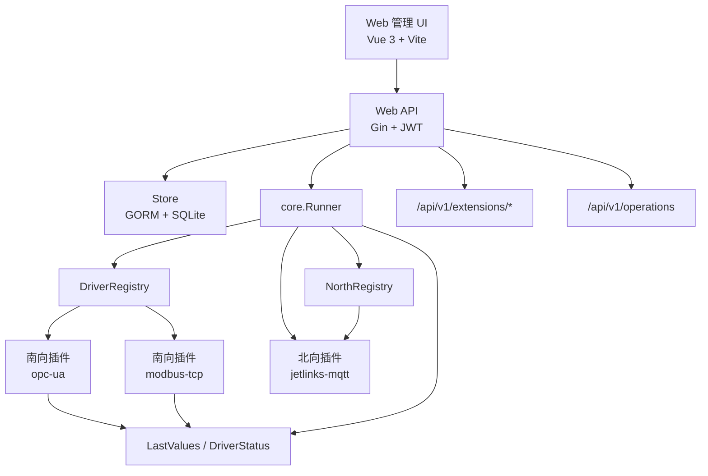

# JetLinks Edge 架构索引

> 本文件保留为架构入口。运维中心视觉、前端页面、后端接口、南北向插件化细节已统一维护在
> [运维中心设计与实现说明](operations-center-design.md)。

## 文档入口

| 文档 | 用途 | 当前处理 |
|---|---|---|
| [operations-center-design.md](operations-center-design.md) | 运维中心前端设计、后端架构、南北向编译期插件化设计、接口契约和验证清单 | 主设计文档 |
| [jetlinks-integration.md](jetlinks-integration.md) | JetLinks MQTT 网关 + 子设备接入协议、主题、认证和上下行消息说明 | 专题保留 |
| [modbus-config.md](modbus-config.md) | Modbus 地址、数据类型、字节序、decimal、bit、性能与错误码说明 | 专题保留 |

原 `architecture.md` 中与运维中心、插件生命周期、动态表单和运行态聚合相关的详细内容已合并到主设计文档，避免多处维护后继续漂移。

## 当前总体架构



## 已确认插件状态

当前注册点位于 `cmd/jetlinks-edge/main.go`：

```go
driverRegistry := core.NewDriverRegistry()
modbus.Register(driverRegistry)
opcua.Register(driverRegistry)

northRegistry := core.NewNorthRegistry()
jetlinks.Register(northRegistry)
```

| 方向 | 插件类型 | 状态 | 说明 |
|---|---|---|---|
| 南向 | `modbus-tcp` | 已实现 | Modbus TCP 点位采集与写入 |
| 南向 | `opc-ua` | 已实现 | OPC UA 连接、点位读写与节点浏览 |
| 北向 | `jetlinks-mqtt` | 已实现 | JetLinks MQTT 网关 + 子设备接入 |

因此，后续文档和页面不要再把 OPC UA 标成“预留”。

## API 入口

| 方法 | 路径 | 说明 |
|---|---|---|
| POST | `/api/v1/auth/login` | 登录获取 JWT |
| GET | `/api/v1/extensions/drivers` | 南向插件描述符、连接 Schema、点位 Schema |
| GET | `/api/v1/extensions/north-apps` | 北向插件描述符和配置 Schema |
| GET | `/api/v1/operations` | 运维中心运行态聚合视图 |
| GET/POST/PUT/DELETE | `/api/v1/groups` | 南向设备点组管理 |
| GET/POST/PUT/DELETE | `/api/v1/tags` | 点位管理 |
| GET/POST/PUT/DELETE | `/api/v1/north-apps` | 北向应用管理 |
| GET | `/api/v1/status` | 基础运行状态 |

## 设计原则摘要

1. 南向设备插件实现 `core.SouthDriver`，可选实现 `core.NodeBrowser`。
2. 北向应用插件实现 `core.NorthHandler`，通过 `NorthAppConfig.CommandExecutor` 回调 Runner 执行下行命令。
3. 插件代码随主程序编译发布，当前不是运行时上传二进制插件。
4. 插件配置必须通过 `ExtensionDescriptor` 暴露 Schema，前端通过 `DynamicConfigForm.vue` 动态渲染。
5. 新增插件时优先补充描述符、配置校验、定向测试和运维状态来源，不为单个插件硬编码专用页面。

更完整的生命周期、热加载、状态聚合和新增插件步骤见 [运维中心设计与实现说明](operations-center-design.md)。
