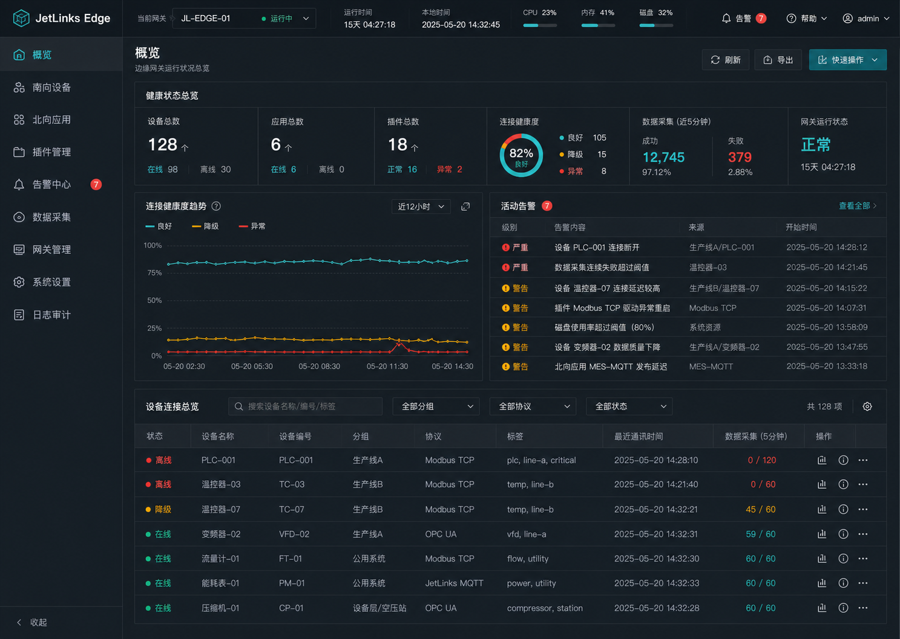
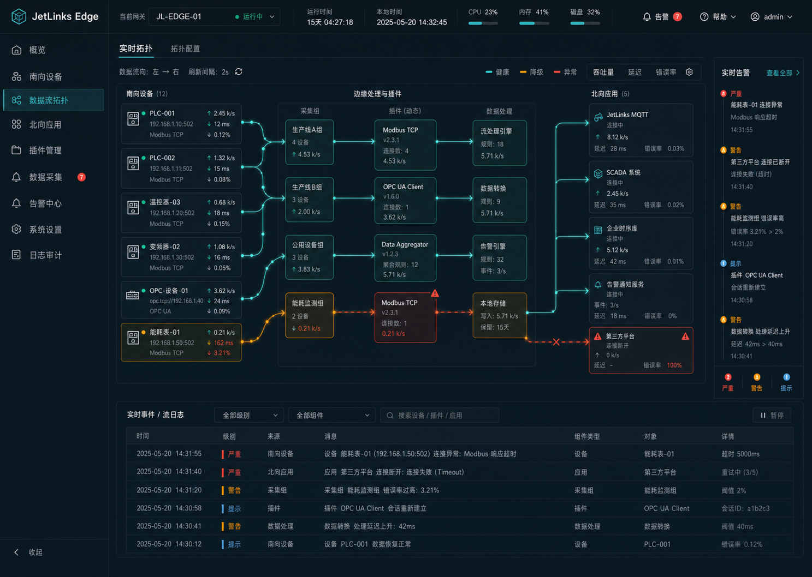
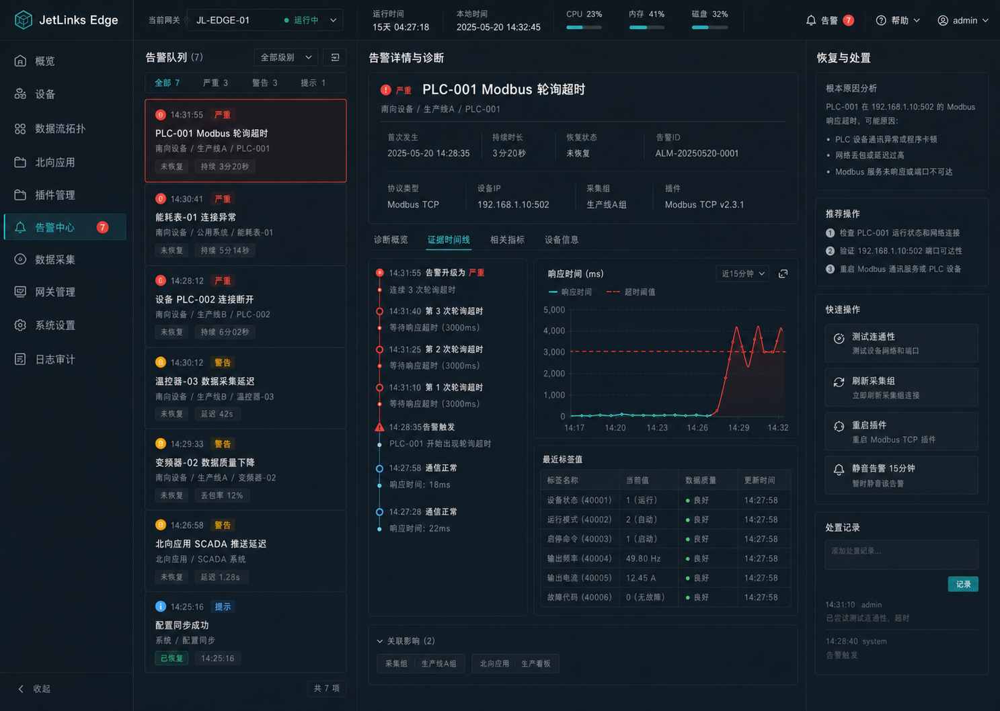
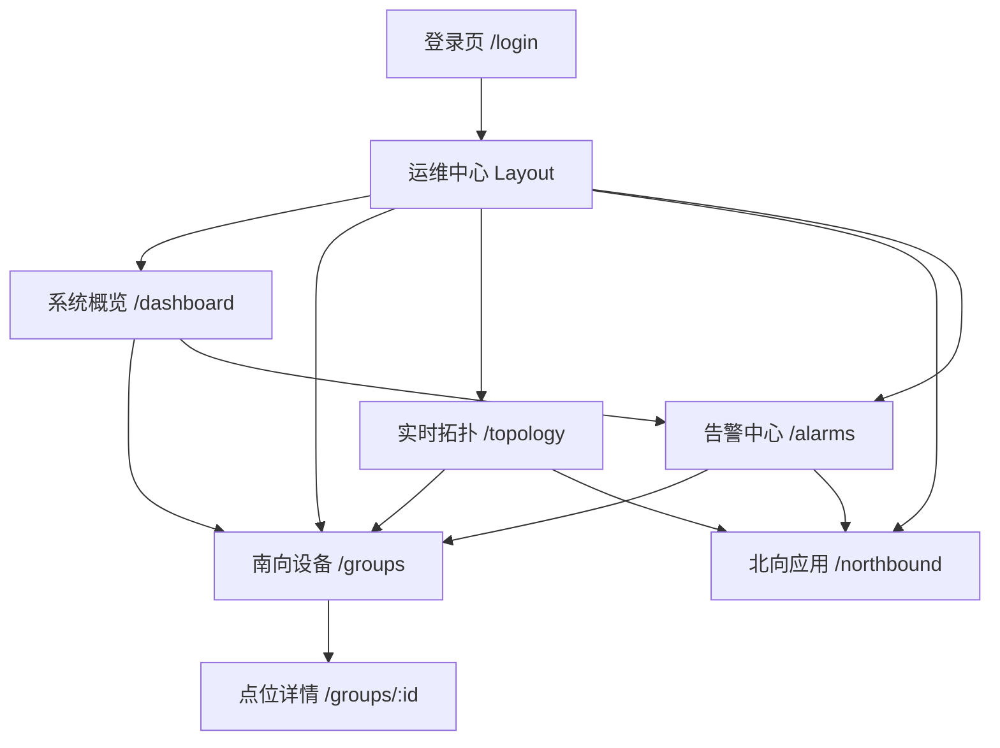
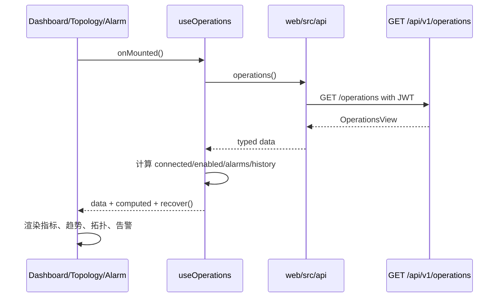
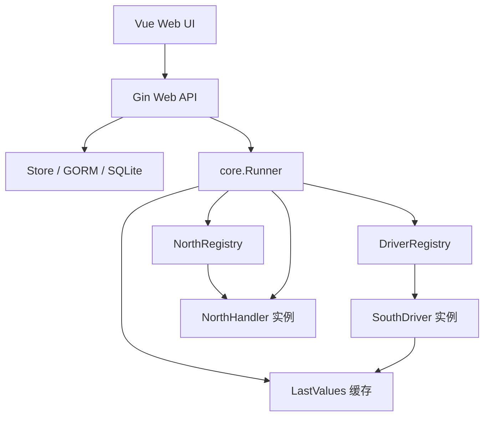
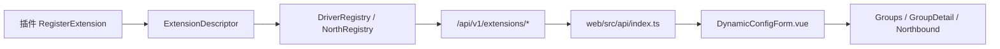
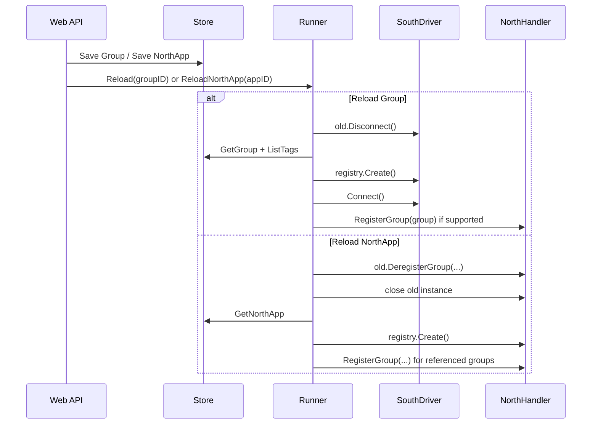
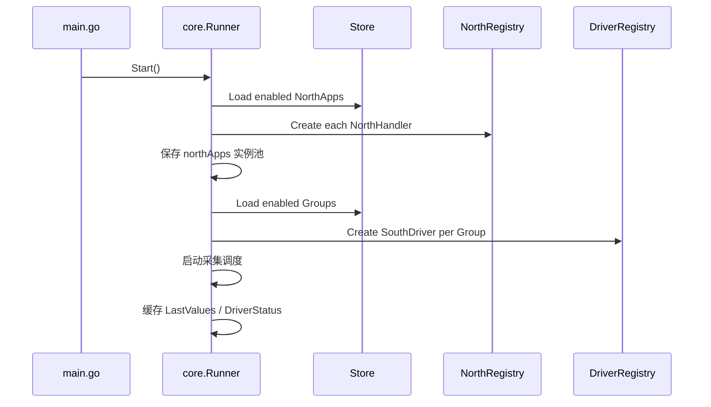
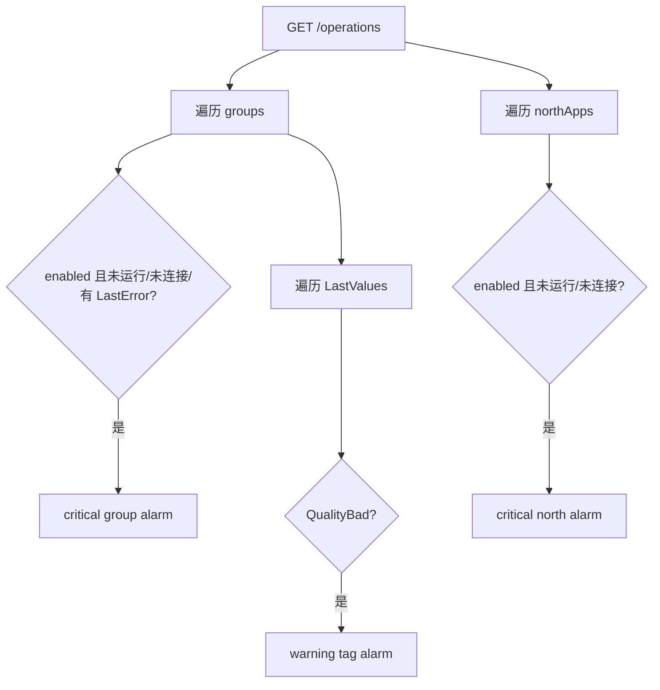

# JetLinks Edge 运维中心设计与实现说明

> 状态：设计稿已落地为第一版可运行实现。本文用于后续继续完善代码时对齐前端视觉、交互、后端架构、接口契约与验证边界。
>
> 最后更新：2026-06-09

## 1. 目标与边界

### 1.1 产品目标

边缘网关前端不应只是 CRUD 表格集合，而应成为运维人员进入系统后的第一工作台。核心目标是：

1. 快速判断边缘网关是否正常运行。
2. 看清南向采集、北向上送、插件注册和告警之间的关系。
3. 能从概览进入南向设备、点位、北向应用、实时拓扑和告警处置。
4. 新增编译期南向或北向插件时，前端配置表单能根据后端 Schema 动态渲染。
5. 页面必须使用真实后端状态，不使用静态演示数据伪造运行效果。

### 1.2 当前范围

| 页面 | 路由 | 文件 | 作用 |
|---|---|---|---|
| 登录页 | `/login` | `web/src/views/LoginView.vue` | 默认登录入口，已统一字体可读性 |
| 系统概览 | `/dashboard` | `web/src/views/DashboardView.vue` | 运行健康、趋势、告警、南向设备总览 |
| 实时拓扑 | `/topology` | `web/src/views/TopologyView.vue` | 南向设备、驱动插件、北向插件、北向应用链路拓扑 |
| 告警中心 | `/alarms` | `web/src/views/AlarmCenterView.vue` | 告警队列、诊断、恢复动作 |
| 南向设备 | `/groups` | `web/src/views/GroupsView.vue` | 南向设备列表与动态驱动配置 |
| 点位详情 | `/groups/:id` | `web/src/views/GroupDetailView.vue` | 点位管理、实时值、OPC UA 节点浏览 |
| 北向应用 | `/northbound` | `web/src/views/NorthboundView.vue` | 北向应用列表与动态北向配置 |

当前方案是“编译期插件 + REST 轮询 + 真实运行态聚合”的一阶段方案。不包含运行时上传二进制插件、长期历史趋势、真实 CPU/磁盘采样、复杂告警规则引擎和 WebSocket/SSE 推送。

## 2. 设计稿来源与视觉方向

### 2.1 原始视觉参考

| 方向 | 本地参考图 |
|---|---|
| 系统概览 | `docs/assets/operations-overview-concept.png` |
| 实时拓扑 | `docs/assets/operations-topology-concept.png` |
| 告警中心 | `docs/assets/operations-alarm-concept.png` |

这些图是方向稿，不是数据事实。实现时必须把演示数据替换为真实接口状态。当前本地数据库为空时，页面应展示真实空态，而不是填充假设备、假告警、假趋势。







### 2.2 设计关键词

| 关键词 | 落地要求 |
|---|---|
| 运维工作台 | 第一屏显示运行、连接、插件、告警，而不是纯表格 |
| 工业边缘 | 深色背景、边框分区、状态色明确，但避免炫技小字 |
| 可读性优先 | 主体文字 12px 以上，常规按钮/表格 13px 左右，标题 18-20px |
| 数据真实 | 指标必须有后端来源，禁止为了视觉密度补假数 |
| 插件动态 | 配置字段由后端 `ExtensionDescriptor` 决定 |
| 一致性 | 南向、北向、概览、拓扑、告警共用同一套视觉语言 |

### 2.3 字体与字号规范

主字体：

```css
-apple-system, BlinkMacSystemFont, "Segoe UI", "PingFang SC",
"Microsoft YaHei", "Helvetica Neue", Arial, sans-serif
```

等宽字体仅用于 ID、数字、时间、短码：

```css
"SFMono-Regular", Consolas, "Liberation Mono", Menlo, monospace
```

字号基准：

| 场景 | 推荐字号 |
|---|---:|
| 页面标题 | 20px |
| 页面副标题 | 13px |
| 面板标题 | 13px |
| 表格正文 | 13px |
| 表头 | 12px |
| 按钮 | 13px |
| 状态标签 | 12-13px |
| 拓扑节点标题 | 13px |
| 告警卡标题 | 14px |
| 时间、ID、短码 | 11-12px |

禁止把中文主体文字设置为 8px、9px、10px。侧栏 `OV/SB/TP` 这类短码可使用 11px。

## 3. 前端架构设计

### 3.1 技术栈与文件职责

当前工程使用 Vue 3、Vite、Pinia、Vue Router、Axios、Naive UI 和本地轻量 `i18n.ts`。

| 文件 | 职责 |
|---|---|
| `web/src/styles/operations.css` | 运维中心共享设计 token、字体、按钮、表格、状态、面板样式 |
| `web/src/views/LayoutView.vue` | 侧栏、顶栏、运行时节点信息、全局导航 |
| `web/src/views/DashboardView.vue` | 系统概览，使用 `useOperations` 聚合状态 |
| `web/src/views/TopologyView.vue` | 四层拓扑视图，使用 Canvas 绘制连线 |
| `web/src/views/AlarmCenterView.vue` | 告警队列、诊断、恢复动作 |
| `web/src/views/GroupsView.vue` | 南向设备列表、创建、编辑、删除、重启 |
| `web/src/views/GroupDetailView.vue` | 点位管理、实时值、OPC UA 浏览 |
| `web/src/views/NorthboundView.vue` | 北向应用列表、创建、编辑、删除、重启 |
| `web/src/components/DynamicConfigForm.vue` | 按插件 Schema 动态渲染配置表单 |
| `web/src/components/OpsTrendChart.vue` | Canvas 趋势图，只绘制运行期快照历史 |
| `web/src/components/TopologyFlowCanvas.vue` | Canvas 拓扑连线 |
| `web/src/composables/useOperations.ts` | 运维聚合状态轮询、派生指标、恢复动作 |
| `web/src/api/index.ts` | REST API 类型与调用封装 |

### 3.2 页面关系



### 3.3 共享视觉组件约定

新增或修改页面时优先复用以下 class，不要在每个页面重新写一套按钮、标题、表格和标签。

| class | 用途 |
|---|---|
| `ops-page` | 页面最大宽度与居中 |
| `ops-heading` | 页面标题 + 操作按钮栏 |
| `ops-title` | 页面主标题 |
| `ops-subtitle` | 页面副标题 |
| `ops-actions` | 页面操作按钮容器 |
| `ops-button` | 普通按钮 |
| `ops-button primary` | 主操作按钮 |
| `ops-panel` | 运维面板 |
| `ops-panel-header` | 面板头 |
| `ops-panel-title` | 面板标题 |
| `ops-table-card` | Naive DataTable 外层视觉容器 |
| `ops-table` | 原生 table 风格 |
| `ops-tag` | 类型、启用状态、绑定状态标签 |
| `ops-state` | 在线、离线、启动中、异常状态 |
| `ops-mono` | ID、时间、数字等短文本 |
| `ops-empty` | 空态 |
| `ops-info` | 弹窗内提示说明 |

### 3.4 交互原则

1. 顶部导航必须稳定，不因页面内容高度变化而跳动。
2. 侧栏只承载一级页面入口，不在侧栏展开复杂树。
3. 南向、北向 CRUD 操作保留 Naive Modal，避免引入新的抽屉/表单框架。
4. 动态配置字段必须由 `DynamicConfigForm.vue` 渲染。
5. 操作按钮文案必须走 `i18n.ts`，不要在最终用户页面散落硬编码文案。
6. Canvas 组件只能做展示，不直接请求接口。
7. 页面中新增指标前必须先说明数据来源。

### 3.5 动态配置表单

前端字段类型与后端 `ConfigFieldType` 对应：

| 后端类型 | 前端组件 |
|---|---|
| `text` | `NInput` |
| `password` | `NInput type=password` |
| `number` | `NInputNumber` |
| `boolean` | `NSwitch` |
| `select` | `NSelect` |
| `textarea` | `NInput type=textarea` |

配置默认值处理：

1. 后端保存前通过 `core.ApplyConfigDefaults` 补默认值。
2. 前端打开创建/编辑时通过 `configDefaults(schema, current)` 补默认值。
3. Schema 未声明但历史数据中存在的字段必须保留，不能因为插件升级丢字段。

### 3.6 前端数据流



`useOperations` 目前通过 `setInterval` 轮询。未来如果加入 SSE/WebSocket，应保留 `OperationsView` 数据结构，替换 hook 内部刷新机制即可。

### 3.7 当前页面设计说明

#### 系统概览

进入系统后 5 秒内判断整体是否健康。展示健康状态总览、连接健康趋势、活动告警、设备连接总览。趋势图只代表当前页面打开后的短期快照，没有真实历史数据前不要标成“24 小时趋势”。

#### 实时拓扑

四层结构：

1. 南向插件：`driverPlugins`
2. 南向设备：`groups`
3. 北向应用：`northApps`
4. 北向应用插件：`northPlugins`

拓扑表达的是“插件归属 + 设备到应用的真实绑定”：

1. 南向插件到南向设备表示该设备使用的驱动类型。
2. 南向设备到北向应用表示真实的上送绑定关系。
3. 北向应用到北向应用插件表示该应用使用的北向实现类型。

插件本身是逻辑能力，不直接承载设备到平台的网络连接；真正的运行连接关系应落在南向设备与北向应用之间。连线由 `TopologyFlowCanvas.vue` 根据 DOM 节点坐标和真实关系绘制，不应在组件内部请求 API。

#### 告警中心

告警来源：

| 来源 | 生成条件 | 严重程度 |
|---|---|---|
| `group` | enabled group 未运行、未连接或存在 `LastError` | critical |
| `north` | enabled north app 未运行或未连接 | critical |
| `tag` | 最近点值质量为 `QualityBad` | warning |

当前告警不是历史事件，只表示当前仍存在的问题。

#### 南向设备、点位详情与北向应用

这些页面保留 CRUD 能力，同时使用运维中心视觉。列表上方展示真实统计区；表格统一使用 `ops-table-card`；驱动类型、北向绑定、启用状态使用 `ops-tag` 或 `ops-state`；创建/编辑表单继续使用 Naive Modal；插件配置继续使用 `DynamicConfigForm`。

## 4. 后端架构设计

### 4.1 总体分层



### 4.2 核心包职责

| 包/文件 | 职责 |
|---|---|
| `internal/core/driver.go` | 南向驱动接口、驱动状态、点值模型 |
| `internal/core/north.go` | 北向应用工厂、命令执行、状态提供接口 |
| `internal/core/extension.go` | 插件描述符、动态配置 Schema、配置校验 |
| `internal/core/registry.go` | 南向/北向注册表 |
| `internal/core/runner.go` | 运行时生命周期、采集调度、北向实例池 |
| `internal/store/store.go` | SQLite 持久化、Group/Tag/NorthApp CRUD |
| `internal/web/server.go` | Gin 路由装配 |
| `internal/web/handler/*.go` | Web API handler |
| `internal/driver/*` | 南向驱动实现 |
| `internal/northbound/*` | 北向应用实现 |

### 4.3 编译期插件模型

当前支持的是“编译期插件”，即插件代码随主程序一起编译发布。

插件化设计的核心目标不是运行时热插拔二进制，而是做到：

1. 后端新增插件时只新增插件包和注册代码。
2. 配置字段通过 `ExtensionDescriptor` 暴露给前端。
3. 前端不为具体插件硬编码专用表单。
4. 运行时通过 `Runner` 统一管理生命周期、状态和热加载。

### 4.3.1 插件化边界

| 维度 | 南向设备插件 | 北向应用插件 |
|---|---|---|
| 业务对象 | `Group` + `Tag` | `NorthApp` |
| 接口 | `core.SouthDriver` | `core.NorthHandler` |
| 工厂 | `core.DriverFactory` | `core.NorthAppFactory` |
| 注册表 | `core.DriverRegistry` | `core.NorthRegistry` |
| 配置 Schema | `ConnectionSchema`、`TagSchema` | `ConfigSchema` |
| 实例粒度 | 每个 enabled Group 一个 driver 实例 | 每个 enabled NorthApp 一个 handler 实例 |
| 运行时归属 | `groupRuntime.driver` | `northAppRuntime.handler` |
| 热加载入口 | `Runner.Reload(groupID)` | `Runner.ReloadNorthApp(appID)` |
| 前端配置页 | `GroupsView`、`GroupDetailView` | `NorthboundView` |

### 4.3.2 南向插件接口

南向插件负责连接工业现场、读取点位、写入点位和返回连接状态。

```go
type SouthDriver interface {
    Name() string
    Connect(ctx context.Context) error
    ReadTags(ctx context.Context, tags []Tag) ([]TagValue, error)
    WriteTag(ctx context.Context, tag Tag, value interface{}) error
    Disconnect() error
    Status() DriverStatus
}
```

可选能力：

```go
type NodeBrowser interface {
    Browse(ctx context.Context, nodeId string) ([]NodeItem, error)
}
```

`NodeBrowser` 当前用于 OPC UA 节点浏览。新增南向协议如果支持树形浏览、扫描点位或自动发现，优先用可选接口扩展，不要把扫描逻辑写进通用 `SouthDriver`。

南向插件必须遵守：

1. `ReadTags` 返回值应与传入 tags 一一对应。
2. 单点失败应尽量返回 `QualityBad` 的 `TagValue`，不要让整个采集循环不可恢复。
3. `Status()` 必须能表达连接状态和最近错误。
4. `Connect()` 可失败，但 `Runner` 会按重连策略继续调度。
5. `Disconnect()` 必须幂等，便于 Reload 和 Stop 安全调用。

### 4.3.3 北向插件接口

北向插件负责把采集消息上送到平台，并接收平台下行命令。

```go
type NorthHandler interface {
    OnMessage(ctx context.Context, msg DeviceMessage) error
    OnCommand(ctx context.Context, cmd NorthCommand) (NorthCommandReply, error)
}
```

北向插件实例化配置：

```go
type NorthAppConfig struct {
    AppID               string
    Config              map[string]interface{}
    CommandExecutor     NorthCommandExecutor
    GroupStatusProvider GroupStatusProvider
}
```

其中：

| 字段 | 作用 |
|---|---|
| `AppID` | 当前北向应用 ID，用于日志、状态、订阅管理 |
| `Config` | 北向插件私有配置，来自 `NorthApp.config` |
| `CommandExecutor` | 北向插件收到平台命令后回调 Runner 执行南向读写 |
| `GroupStatusProvider` | 北向插件读取南向连接状态，不直接拥有南向生命周期 |

北向插件必须遵守：

1. 不直接创建或管理南向 driver。
2. 下行命令必须通过 `CommandExecutor` 回到 Runner。
3. 连接失败不应阻塞 API 创建；如 JetLinks MQTT 当前使用短超时 + 后台重连。
4. 如果支持 Group 注册/注销，使用内部 refCount 避免重复订阅或遗漏退订。
5. `Close()` 或等价清理逻辑必须释放网络连接、订阅和 goroutine。

### 4.3.4 注册与发现

当前主程序注册点在 `cmd/jetlinks-edge/main.go`：

```go
driverRegistry := core.NewDriverRegistry()
modbus.Register(driverRegistry)
opcua.Register(driverRegistry)

northRegistry := core.NewNorthRegistry()
jetlinks.Register(northRegistry)
```

已确认当前内置插件：

| 方向 | 插件类型 | 当前状态 |
|---|---|---|
| 南向 | `modbus-tcp` | 已实现 |
| 南向 | `opc-ua` | 已实现，含节点浏览 |
| 北向 | `jetlinks-mqtt` | 已实现 |

文档或页面中不要再把 OPC UA 写成“预留”。

### 4.3.5 Schema 到前端的链路



南向：

1. `connectionSchema` 渲染 Group 连接配置。
2. `tagSchema` 渲染 Tag 点位私有配置。
3. `GroupsView` 负责 Group 创建/编辑。
4. `GroupDetailView` 负责 Tag 创建/编辑。

北向：

1. `configSchema` 渲染 NorthApp 配置。
2. `NorthboundView` 负责 NorthApp 创建/编辑。

新增字段类型时必须同步修改：

1. `core.ConfigFieldType`
2. `core.ValidateConfig`
3. `web/src/api/index.ts` 的 `ConfigFieldType`
4. `DynamicConfigForm.vue`
5. 至少一个插件描述符测试或页面构建验证

### 4.3.6 生命周期与热加载细节



关键约束：

1. Web handler 的 request context 不能传给长期运行的采集 goroutine。
2. Runner 必须使用内部 background context 派生运行时任务。
3. Reload 时先停止旧实例，再替换运行时引用，避免同一 Group 双采集。
4. 北向应用重建时，应恢复引用它的 Group 注册关系。
5. 删除 NorthApp 时必须让 Group 的 `northAppId` 失效或为空，避免悬挂引用。

### 4.3.7 状态与观测

插件状态最终会进入 `/api/v1/operations`：

| 状态来源 | 进入字段 |
|---|---|
| `SouthDriver.Status()` | `groups[].running/connected/lastError/stats` |
| `Runner.LastValues(groupID)` | `recentValues`、tag 告警 |
| `Runner.ListNorthAppStatus()` | `northApps[]`、north 告警 |
| `DriverRegistry.Descriptors()` | `driverPlugins[]` |
| `NorthRegistry.Descriptors()` | `northPlugins[]` |

插件实现时不要只保证连接能跑，还要保证状态能被正确展示。否则前端运维中心会出现“实际异常但页面正常”的假象。

南向插件注册：

```go
driverRegistry.RegisterExtension(core.ExtensionDescriptor{
    Type: "modbus-tcp",
    Name: "Modbus TCP",
    Version: "0.1.0",
    ConnectionSchema: []core.ConfigField{...},
    TagSchema: []core.ConfigField{...},
}, factory)
```

北向插件注册：

```go
northRegistry.RegisterExtension(core.ExtensionDescriptor{
    Type: "jetlinks-mqtt",
    Name: "JetLinks MQTT",
    Version: "0.1.0",
    ConfigSchema: []core.ConfigField{...},
}, factory)
```

新增插件必须注册 `ExtensionDescriptor`，提供 Schema，后端保存时按 Schema 校验配置，插件类型 `Type` 全局唯一，并增加必要单元测试。

### 4.4 Runner 生命周期



多个 Group 可以引用同一个 NorthApp。Runner 内维护北向实例池，Group 启动时引用池中的实例，避免每个南向设备都创建一条 MQTT 连接。

关键规则：

1. NorthApp 配置变更时重建该 NorthApp 实例。
2. Group 配置变更时重建对应 Driver。
3. 删除 NorthApp 时必须解除 Group 引用或保证运行态不再引用已删除实例。
4. Group 不绑定 NorthApp 时只采集不上送。

### 4.5 运维聚合接口

新增接口：

| 方法 | 路径 | Handler |
|---|---|---|
| GET | `/api/v1/operations` | `StatusHandler.Operations` |

该接口面向运维中心页面，不替代 CRUD API。它只组合当前状态，不写数据库。

响应结构：

```ts
interface OperationsView {
  generatedAt: string
  startTime: string
  runtime: OperationRuntime
  groups: OperationGroup[]
  northApps: NorthAppStatus[]
  driverPlugins: ExtensionDescriptor[]
  northPlugins: ExtensionDescriptor[]
  alarms: OperationAlarm[]
  recentValues: OperationValue[]
}
```

`runtime` 当前只使用 Go runtime 与主机名：

| 字段 | 来源 | 说明 |
|---|---|---|
| `nodeId` | `os.Hostname()` | 本机节点名，失败时为 `jetlinks-edge` |
| `goroutines` | `runtime.NumGoroutine()` | Go 协程数量 |
| `memoryAllocBytes` | `runtime.ReadMemStats` | 当前分配内存 |
| `memorySysBytes` | `runtime.ReadMemStats` | Go 从系统申请内存 |
| `memoryUsedPercent` | `Alloc / Sys` | Go runtime 视角，不等同系统内存 |
| `uptimeSeconds` | `time.Since(runner.StartTime())` | 运行时长 |

禁止在没有真实采样实现前展示 CPU、磁盘、网卡吞吐。

### 4.6 告警生成规则



后续如果要做历史告警，应新增持久化模型和独立告警服务，不要把历史逻辑塞进 `StatusHandler.Operations`。

## 5. 接口契约

### 5.1 插件描述符

后端：

```go
type ExtensionDescriptor struct {
    Type             string        `json:"type"`
    Name             string        `json:"name"`
    Description      string        `json:"description,omitempty"`
    Version          string        `json:"version"`
    Capabilities     []string      `json:"capabilities,omitempty"`
    ConnectionSchema []ConfigField `json:"connectionSchema,omitempty"`
    TagSchema        []ConfigField `json:"tagSchema,omitempty"`
    ConfigSchema     []ConfigField `json:"configSchema,omitempty"`
}
```

前端：

```ts
export interface ExtensionDescriptor {
  type: string
  name: string
  description?: string
  version: string
  capabilities?: string[]
  connectionSchema?: ConfigField[]
  tagSchema?: ConfigField[]
  configSchema?: ConfigField[]
}
```

Schema 字段变更时必须同时检查 `core.ValidateConfig`、`web/src/api/index.ts`、`DynamicConfigForm.vue`、现有插件描述符和创建/编辑表单默认值。

### 5.2 OperationsView

前端类型定义在 `web/src/api/index.ts`。后端 DTO 当前定义在 `internal/web/handler/status.go` 内部。

后续如果该接口继续扩大，建议：

1. 将 DTO 移到独立文件 `internal/web/handler/operation_view.go`。
2. 对告警聚合拆出纯函数，方便单元测试。
3. 对 runtime 快照拆出接口，便于未来替换为真实系统采样。

## 6. 继续开发指南

### 6.1 新增南向插件

1. 在 `internal/driver/<plugin>` 下实现 `core.SouthDriver`。
2. 在启动注册处调用 `DriverRegistry.RegisterExtension`。
3. 补 `ConnectionSchema` 和 `TagSchema`。
4. 后端测试覆盖配置校验和关键读写路径。
5. 前端无需为插件新建表单页面，确认 `DynamicConfigForm` 能渲染新增字段类型即可。
6. 如果需要新的字段类型，先扩展 `ConfigFieldType`、后端校验、前端组件映射。

### 6.2 新增北向插件

1. 在 `internal/northbound/<plugin>` 下实现 `core.NorthHandler`。
2. 在启动注册处调用 `NorthRegistry.RegisterExtension`。
3. 补 `ConfigSchema`。
4. 确认 `ListNorthAppStatus` 能返回运行与连接状态。
5. 在 `/operations` 中不需要特殊判断，除非新增插件有独立健康维度。
6. 前端 `NorthboundView` 应自动出现新的类型选项。

### 6.3 新增运维指标

新增指标必须回答：数据来源是什么、是瞬时值还是历史窗口、刷新频率是多少、空态如何展示、是否影响后端性能。如果没有后端事实来源，不要在页面上展示。

### 6.4 拆分大文件建议

当前 `GroupDetailView.vue` 超过 300 行，是历史大文件。继续开发时优先拆分：

| 建议组件 | 责任 |
|---|---|
| `TagTable.vue` | 点位表格列、读写按钮 |
| `TagEditModal.vue` | 点位新增/编辑表单 |
| `OpcUaBrowseModal.vue` | OPC UA 节点浏览与批量添加 |
| `useTags.ts` | 点位 CRUD、实时值轮询、读写动作 |

拆分时必须保持当前路由、表单字段、OPC UA 批量添加、读写点位行为不变。

## 7. 验证清单

每次修改相关代码后至少执行：

```bash
cd jetlinks-edge
env GOCACHE=/tmp/jetlinks-edge-go-cache /usr/local/bin/go test -p 1 ./internal/web/handler ./internal/web
```

前端：

```bash
cd jetlinks-edge/web
/Users/zhangjinhu/.nvm/versions/node/v22.16.0/bin/node node_modules/vue-tsc/bin/vue-tsc.js -b
/Users/zhangjinhu/.nvm/versions/node/v22.16.0/bin/node node_modules/vite/bin/vite.js build
```

格式与静态检查：

```bash
git diff --check -- jetlinks-edge
```

仓库要求还包含：

```bash
graphify update .
```

当前环境中该命令可能不存在。如果失败，应在最终说明中明确写出 `graphify: command not found`，不要假装已更新图谱。

## 8. 已知限制与风险

| 项 | 当前状态 | 后续建议 |
|---|---|---|
| 历史趋势 | 只基于页面轮询快照 | 需要持久化时间序列或后端窗口统计 |
| 告警 | 当前态派生，不落库 | 新增告警服务与事件表 |
| CPU/磁盘 | 未采样，未展示 | 设计真实采样实现后再加 |
| WebSocket/SSE | 未实现 | 状态频率高时替换轮询 |
| `GroupDetailView.vue` | 历史大文件 | 拆分组件和 hook |
| Product Design 截图 QA | 已有旧对比图，后续字号修改未重新截图 | 安装或提供 Playwright 环境后补截图 |
| Naive UI chunk | 构建提示大 chunk | 后续按需拆包或 manualChunks |

## 9. 文档维护决策

本次整理后，`docs` 目录中的边缘网关文档按以下职责维护：

| 文档 | 是否保留 | 维护职责 |
|---|---|---|
| `architecture.md` | 保留但收敛 | 作为架构入口索引，只放当前架构事实、插件状态、API 入口和主设计文档链接 |
| `operations-center-design.md` | 保留并作为主文档 | 维护运维中心前端设计、后端架构、插件化机制、接口契约、验证清单和后续修改守则 |
| `jetlinks-integration.md` | 保留 | 维护 JetLinks MQTT 网关 + 子设备接入协议、主题、认证和上下行消息 |
| `modbus-config.md` | 保留 | 维护 Modbus 地址、类型、字节序、缩放、bit、性能和错误码说明 |
| `docs/assets/*.png` | 保留 | 保存三张产品视觉方向稿，便于设计核对；它们不是运行数据事实 |

维护规则：

1. 运维中心、南北向插件化、动态 Schema、`/operations` 聚合接口的详细设计只在本文维护。
2. `architecture.md` 不再重复生命周期、状态聚合和页面实现细节，避免旧架构内容再次过时。
3. JetLinks MQTT 协议和 Modbus 配置属于专题知识，分别保留在对应专题文档。
4. 视觉稿应保存在 `docs/assets/`，不要引用本机临时生成目录。
5. 文档中涉及插件状态时必须以当前代码注册点为依据；已实现的 OPC UA 不应再写成预留。

## 10. 后续 agent 修改守则

1. 先读本文，再读 `docs/architecture.md`。
2. 不要把概念图中的假设备、假告警写进页面。
3. 不要再把主体中文压到 8-10px。
4. 不要为某个插件硬编码专用表单，优先扩展 Schema。
5. 不要把 UI 组件写成直接请求 API 的副作用组件。
6. 新增后端字段必须同步 `web/src/api/index.ts` 类型。
7. 新增用户可见文案要走 `web/src/i18n.ts`。
8. 新增运行指标必须补来源说明和空态策略。
9. 修改南北向生命周期必须跑后端定向测试。
10. 交付前写清楚已验证命令和未验证风险。
